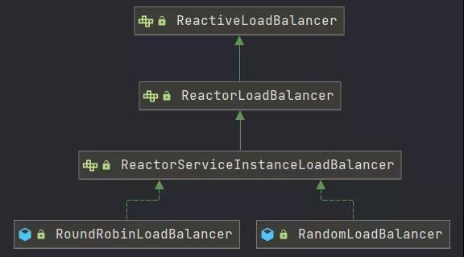

# spring cloud gateway 灰度发布，服务路由


## spring cloud gateway Finchley 动态权重路由

参考：
[SpringCloud2.x 的权重路由和灰度控制,以及gateway的路由持久化](https://blog.csdn.net/cdy1996/article/details/94316726?spm=1001.2101.3001.6650.2&utm_medium=distribute.pc_relevant.none-task-blog-2%7Edefault%7ECTRLIST%7ERate-2.pc_relevant_antiscanv2&depth_1-utm_source=distribute.pc_relevant.none-task-blog-2%7Edefault%7ECTRLIST%7ERate-2.pc_relevant_antiscanv2&utm_relevant_index=3)


## spring cloud 2020 服务路由

[网关的灰度发布](https://developer.51cto.com/article/665949.html)

Spring Cloud provides its own client-side load-balancer abstraction and implementation. For the load-balancing mechanism, ReactiveLoadBalancer interface has been added and a Round-Robin-based and Random implementations have been provided for it. In order to get instances to select from reactive ServiceInstanceListSupplier is used. Currently we support a service-discovery-based implementation of ServiceInstanceListSupplier that retrieves available instances from Service Discovery using a Discovery Client available in the classpath.

结合文档中的其他内容，提取出几条关键信息：

Spring Cloud LoadBalancer提供了两种负载均衡算法：Round-Robin-based 和 Random，默认使用Round-Robin-based

可以通过实现ServiceInstanceListSupplier来筛选符合要求的服务实例

需要通过 LoadBalancerClient 注解，指定服务级别的负载均衡策略以及实例选择策略

提示：如果大家需要探究SCL的实现原理，可以通过GatewayReactiveLoadBalancerClientAutoConfiguration入手。

自定义灰度发布
结合上文，利用Spring Cloud LoadBalancer实现灰度我们有两种实现方式：

简单粗暴，直接实现一个新的负载均衡策略，然后通过LoadBalancerClient注解指定服务实例使用此策略。

自定义服务实例筛选逻辑，在返回给前端实例时筛选出符合要求的服务实例，当然也需要通过LoadBalancerClient注解指定服务实例使用此选择器。

## spring async 上下文问题

异步 就涉及到一个上下文切换的问题, 像Spring的Request对象其实存在一个 上下文对象中 , 我们可以去拿取, 前提是你的所有执行逻辑是一个线程. 像 ServletRequestAttributes
requestAttributes = (ServletRequestAttributes) RequestContextHolder.getRequestAttributes(); 就是获取上下文. 他会在我么逻辑中拦截 , 并且注入.
但是有的时候涉及到异步上下文.

```
@Slf4j
@Service
public class UserService {

    @Async
    public void find() {
        ServletRequestAttributes requestAttributes = (ServletRequestAttributes) RequestContextHolder.getRequestAttributes();

        if (requestAttributes == null) {
            log.info("当前线程为 {} 位置为{} require对象为空.", Thread.currentThread().getName(),  "service");
        } else {
            HttpServletRequest request = requestAttributes.getRequest();
            log.info("当前线程为 {}，请求方法为 {}，请求路径为：{} 位置为:{}", Thread.currentThread().getName(), request.getMethod(), request.getRequestURL(), "service");
        }
    }
}
```

此时上下文不存在 . 所以需要我们手动去配置一下 ,spring提供了 很好地操作对象.

```
@Configuration
public class Config {
    private static final String ASYNC_EXECUTOR_NAME = "asyncExecutor";

    @Bean(name = ASYNC_EXECUTOR_NAME)
    public Executor executor() {
        ThreadPoolTaskExecutor executor = new ThreadPoolTaskExecutor();
        executor.setThreadNamePrefix(ASYNC_EXECUTOR_NAME);
        executor.setCorePoolSize(5);
        executor.setMaxPoolSize(5);
        executor.setQueueCapacity(-1);
        // 这里在每次异步调用的时候, 会包装一下.
        executor.setTaskDecorator(runnable -> {
            // 这个时候还是同步状态
            RequestAttributes requestAttributes = RequestContextHolder.currentRequestAttributes();
            // 返回的这个 runnable对象 才是去调用线程池.
            return () -> {
                try {
                    // 我们set 进去 ,其实是一个ThreadLocal维护的.
                    RequestContextHolder.setRequestAttributes(requestAttributes);
                    runnable.run();
                } finally {
                    // 最后记得释放内存
                    RequestContextHolder.resetRequestAttributes();
                }
            };
        });
        return executor;
    }
}
```

参考：以下两种方式皆可
[spring async 上下文问题](https://juejin.cn/post/6844904135850983431)
[Spring 异步注解 @Async 与线程池配置(源码解析)](https://blog.csdn.net/HX0326CSDN/article/details/121655391)